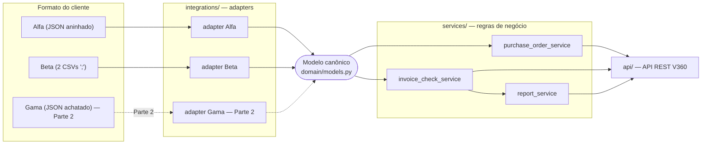
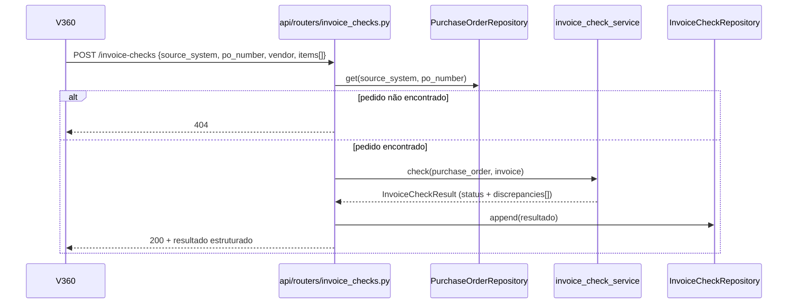
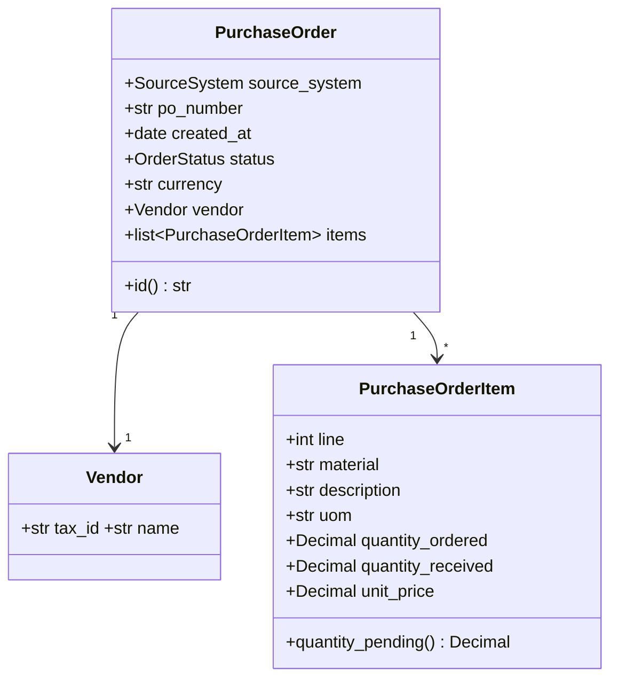

# Design — Conector de Pedidos de Compra V360

Este documento explica **como** o sistema atende ao `requirements.md`. As decisões mais
relevantes ficam registradas em contexto; a tabela da seção 11 reúne todas elas (com alternativa
considerada e trade-off) num único lugar de consulta rápida.

## 1. Visão geral

Serviço HTTP único (FastAPI) em quatro camadas, cada uma com responsabilidade que não se
sobrepõe às demais:



**Regra de ouro**: tudo que é específico de um cliente vive em `integrations/<cliente>/` e nunca
ultrapassa a fronteira do adapter. `domain/`, `services/` e `api/` só conhecem o modelo canônico
— nunca um `if source_system == "alfa"`.

**Ingestão** (`POST /ingestion/{cliente}`): o router recebe o payload bruto, chama
`adapter.parse_orders(...)`, que normaliza e devolve `list[PurchaseOrder]`; o router persiste
cada pedido no repositório e devolve um resumo.

**Conferência** — o fluxo mais importante do desafio:



## 2. Estrutura de diretórios

```
app/
├── main.py                        # cria o FastAPI app e inclui os routers
├── api/
│   ├── routers/
│   │   ├── ingestion.py           # POST /ingestion/{alfa,beta,gama}
│   │   ├── purchase_orders.py     # GET /purchase-orders, GET /purchase-orders/{fmt}/{po}
│   │   ├── invoice_checks.py      # POST/GET /invoice-checks
│   │   └── reports.py             # GET /reports/invoice-checks
│   └── schemas/                   # Pydantic de request/response da API (DTOs, desacoplados do domínio)
│       ├── purchase_order.py
│       ├── invoice_check.py
│       └── report.py
├── domain/
│   ├── enums.py                   # SourceSystem, OrderStatus, DivergenceType, CheckStatus
│   ├── models.py                  # Vendor, PurchaseOrderItem, PurchaseOrder (modelo canônico)
│   ├── invoice.py                 # Invoice, InvoiceItem (entrada de uma conferência)
│   ├── discrepancies.py           # Discrepancy, InvoiceCheckResult
│   └── exceptions.py              # PurchaseOrderNotFoundError, AdapterParsingError
├── normalization/                 # transformações puras de FORMATO, reaproveitáveis entre adapters
│   ├── dates.py                   # parse_iso_date, parse_br_date, parse_unix_timestamp
│   ├── money.py                   # parse_decimal, parse_br_decimal, cents_to_decimal
│   └── documents.py               # normalize_tax_id (CNPJ → só dígitos)
├── integrations/                  # tudo que é específico de um cliente, incluindo vocabulário de status
│   ├── alfa/    {schemas.py, adapter.py}
│   ├── beta/    {schemas.py, adapter.py}
│   └── gama/    {schemas.py, adapter.py}   # só existe a partir da Parte 2
├── services/                      # regras de negócio sobre o modelo canônico — não sabem de onde o pedido veio
│   ├── purchase_order_service.py  # listar/filtrar/detalhar pedidos
│   ├── invoice_check_service.py   # regra central de conferência e detecção de divergências
│   └── report_service.py          # agregação das conferências já realizadas
└── storage/                       # estado em memória — não valida regra de negócio
    ├── purchase_order_repository.py   # dict, chave (source_system, po_number)
    └── invoice_check_repository.py    # lista de resultados de conferência
```

Não existe uma camada "use cases"/"controllers" adicional: com 3 clientes e 3 operações de
negócio, um router fino chamando um service já é suficiente e mais fácil de explicar.

## 3. Modelo canônico



| Campo | Por que existe |
|---|---|
| `source_system` | Origem do pedido — só para filtro/rastreio; identidade real é o par com `po_number` (§11, D6), já que dois clientes podem reaproveitar numeração. |
| `po_number` | Identificador no sistema de origem; é o que a nota fiscal referencia. |
| `created_at: date` | Três formatos de entrada (ISO, `DD/MM/YYYY`, Unix timestamp) convergem para um único tipo. |
| `status: OrderStatus` | Vocabulário fechado (`OPEN/CLOSED/BLOCKED`) — o filtro de situação (RF4.1) funciona igual para todos os clientes. |
| `currency` | Existe no modelo, mas todo o domínio assume `BRL` hoje (suposição S1) — deixa claro que multi-moeda é não-requisito, não esquecimento. |
| `vendor.tax_id` | Normalizado para dígitos (§4.2) — chave de comparação na conferência (`VENDOR_MISMATCH`). |
| `items[].material` | Chave de casamento entre item da nota e item do pedido (`MATERIAL_NOT_IN_ORDER`). |
| `items[].uom` | Unidade de estoque **após** normalização — sempre a mesma da nota fiscal (§4.4). |
| `items[].quantity_ordered/received` | Base do saldo pendente (RN2) e da conferência de quantidade. |
| `items[].unit_price` | Já na unidade de estoque — base para `PRICE_MISMATCH`. |

**`quantity_pending` é calculado** (`quantity_ordered - quantity_received`), nunca um campo
persistido — armazenar os dois criaria duas fontes de verdade com risco de dessincronizar.
Recalcular é uma subtração; o único custo é lembrar de expor a propriedade nos DTOs de resposta.

## 4. Normalização (o que acontece na fronteira)

Acontece **inteiramente dentro do adapter**, antes de qualquer `PurchaseOrder` ser criado —
`services/` e `api/` só recebem dados já normalizados. `normalization/` guarda só transformação
de **formato** (reaproveitável); o **vocabulário de negócio** de cada cliente (`"EM ABERTO"` →
`OPEN`) fica no adapter, porque não é reutilizável entre clientes.

### 4.1 Datas

| Cliente | Formato | Função |
|---|---|---|
| Alfa | `"2026-08-05"` (ISO) | `parse_iso_date` |
| Beta | `"15/08/2026"` | `parse_br_date` |
| Gama | `1786752000` (Unix, segundos) | `parse_unix_timestamp` |

Todas convergem para `date` — sem hora/fuso, nenhum requisito precisa de granularidade menor.

### 4.2 Valores monetários e CNPJ

**Todo valor monetário é `Decimal`, nunca `float`** — `float` tem erro de representação binária
(`Decimal(45.9)` direto dá `45.89999999999999857...`; só convertendo via `str()` antes se obtém
`45.9` exato), o que poderia gerar uma divergência de preço falsa ou mascarar uma real. O custo é
cuidado extra na desserialização; o ganho é que a única tolerância que resta é a intencional
(arredondamento de 2 casas, RN5), nunca erro de cálculo escondido.

Conversões: Alfa já manda `int`/`float` do JSON (`parse_decimal`, via `str()`); Beta manda string
BR (`"1.200,000"` → remove milhar, troca `,`/`.` → `parse_br_decimal`); Gama manda centavos
(`120000` → `Decimal(120000)/100` → `cents_to_decimal`).

**CNPJ vira dígitos só** (`normalize_tax_id`, remove `.`, `/`, `-`) — é a única forma de comparar
`"12.345.678/0001-90"` (Beta) com `"12345678000190"` (Alfa/Gama) por igualdade simples, sem lógica
extra em `services/`. Se a API precisar devolver CNPJ mascarado, é formatação de apresentação no
DTO, não mudança de domínio.

### 4.3 Situação (status)

Vocabulário fechado (`OPEN/CLOSED/BLOCKED`); cada adapter mantém seu próprio mapa e **falha
explicitamente** se encontrar um valor desconhecido (RN1) — nunca atribui um status "padrão"
silenciosamente.

| Cliente | Vocabulário de origem | Canônico |
|---|---|---|
| Alfa | `open` / `closed` / `blocked` | `OPEN` / `CLOSED` / `BLOCKED` |
| Beta | `EM ABERTO` / `ENCERRADO`* / `BLOQUEADO` | `OPEN` / `CLOSED` / `BLOCKED` |
| Gama | `1` / `2` / `3` | `OPEN` / `CLOSED` / `BLOCKED` |

\* Suposição S7 — `ENCERRADO` não aparece nas amostras do Beta.

### 4.4 Unidades — a particularidade do Gama

O enunciado é explícito: **a nota fiscal sempre informa quantidade em unidades, nunca em caixa**.
Logo `invoice_check_service` pode assumir, sem exceção, que o pedido canônico já está na mesma
unidade da nota — nunca precisa saber o que é `fator_conv` ou `CX`. Toda a conversão acontece
dentro de `integrations/gama/adapter.py`:

```
quantity_ordered_canonico  = qtd_ped * fator_conv     (se um == "CX"; senão, passa direto)
quantity_received_canonico = qtd_rec * fator_conv
unit_price_canonico        = (preco_unit_centavos / 100) / fator_conv
uom_canonico                = "UN"
```

Exemplo do enunciado: `10 CX`, `fator_conv=12`, `preco_unit_centavos=120000` (R$1.200,00/caixa) →
`quantity_ordered=120`, `unit_price=R$100,00`. `10 × 100 = 1.200 = 12 × 100`: o valor total é
preservado pela conversão.

**O modelo canônico guarda só a quantidade/preço já em unidade de estoque** — não guarda
`fator_conv` nem a unidade de compra original, porque nenhum requisito pede exibir a embalagem de
compra; o único consumidor dessa informação é a conferência, que compara sempre em unidade de
estoque. Se um dia for preciso mostrar "10 CX" na tela, isso é campo novo (aditivo), não mudança
de regra.

**Implicação para a Parte 2**: introduzir o Gama não exige nenhuma mudança em `domain/`,
`services/` ou `api/` para tratar unidades — toda a complexidade fica contida no adapter.

## 5. Adapters

Cada adapter expõe uma função pública `parse_orders(...) -> list[PurchaseOrder]`. A assinatura de
entrada é diferente entre eles (Alfa recebe JSON; Beta recebe dois textos CSV; Gama recebe JSON
achatado) porque os formatos de origem são, de fato, diferentes — forçar uma interface comum
(`Protocol` com assinatura idêntica) exigiria um "menor denominador comum" artificial que só
empurraria complexidade pra dentro de cada adapter sem ganho real. **A uniformidade está no
retorno (`list[PurchaseOrder]`), não na entrada.**

- **Alfa**: `schemas.py` espelha o JSON bruto (Pydantic, só validação). `adapter.py` monta o
  `PurchaseOrder` usando `ALFA_STATUS_MAP` + os normalizadores de §4.
- **Beta**: `schemas.py` tem `BetaHeaderRow`/`BetaItemRow` (uma linha de cada CSV). `adapter.py`
  lê os dois CSVs com `csv.DictReader(delimiter=";")`, agrupa itens por `NUMERO_PEDIDO`; cabeçalho
  sem itens correspondentes vira pedido com lista vazia (não é erro); item referenciando pedido
  sem cabeçalho levanta erro explícito (dado inconsistente entre os dois arquivos).
- **Gama** (Parte 2): `adapter.py` agrupa linhas por `ped` (dados de cabeçalho se repetem em cada
  linha — usa-se a primeira do grupo) e aplica a conversão de unidade (§4.4) quando `um == "CX"`.

## 6. Serviços de domínio

**`purchase_order_service`** — `list_orders(source_system, vendor_tax_id, status, has_pending)` e
`get_order(...)`, funções puras sobre o repositório. `has_pending=True` filtra pedidos com
**pelo menos um item** com `quantity_pending > 0`.

**`invoice_check_service`** — o coração do desafio. Entrada: `PurchaseOrder` + `Invoice`. Roda até
o fim, sem parar na primeira divergência (RF5.2):

1. **Fornecedor**: `normalize_tax_id(invoice.vendor.tax_id) != order.vendor.tax_id` →
   `VENDOR_MISMATCH`.
2. Por item da nota: casa por `material` exato → `MATERIAL_NOT_IN_ORDER` se não achar; soma
   `quantity_pending` das linhas casadas (suposição S3: normalmente uma só) e compara com a
   quantidade da nota → `QUANTITY_EXCEEDS_PENDING`; compara `unit_price × quantity` (arredondado a
   2 casas, `ROUND_HALF_UP`, só pra eliminar ruído de representação — RN5) com o valor da nota →
   `PRICE_MISMATCH`.
3. `status = DIVERGENT` se a lista de divergências não estiver vazia, senão `COMPLIANT`.

Não consulta o repositório nem sabe de HTTP — só objetos de domínio, trivialmente testável.

**`report_service`** — lê todo o histórico do `InvoiceCheckRepository` e agrega com
`collections.Counter`: total, conformes, divergentes, contagem por tipo.

## 7. Divergências

| Tipo | Quando é gerada |
|---|---|
| `VENDOR_MISMATCH` | CNPJ da nota (normalizado) ≠ CNPJ do pedido |
| `MATERIAL_NOT_IN_ORDER` | Material da nota não existe em nenhum item do pedido |
| `QUANTITY_EXCEEDS_PENDING` | Quantidade da nota, pra um material, excede o saldo pendente |
| `PRICE_MISMATCH` | `quantidade × preço unitário do pedido` não bate com o valor da nota |

Formato genérico (`Discrepancy`: `type`, `material`, `message`, `expected`, `actual`) — adicionar
um tipo novo é só um valor de enum + um passo de verificação, sem nova classe nem migração.

**Princípio**: diferenças de representação (máscara de CNPJ, `,` vs `.`, formato de data) são
absorvidas na normalização (§4) e nunca chegam aqui — só diferença de significado de negócio vira
`Discrepancy`.

## 8. Contrato da API

| Método | Rota | Propósito | Requisito |
|---|---|---|---|
| `POST` | `/ingestion/alfa` | Ingere pedidos do Alfa (JSON) | RF1 |
| `POST` | `/ingestion/beta` | Ingere pedidos do Beta (multipart, 2 CSVs) | RF2 |
| `POST` | `/ingestion/gama` | Ingere pedidos do Gama (JSON achatado) — **Parte 2** | RF7 |
| `GET` | `/purchase-orders` | Lista com filtros `source_system`/`vendor_tax_id`/`status`/`has_pending` | RF4.1 |
| `GET` | `/purchase-orders/{source_system}/{po_number}` | Detalhe, com itens e saldo pendente | RF4.2 |
| `POST` | `/invoice-checks` | Confere nota fiscal contra pedido; resultado estruturado | RF5 |
| `GET` | `/invoice-checks` | Histórico de conferências | RF6 (apoio) |
| `GET` | `/reports/invoice-checks` | Relatório agregado | RF6 |

**Dois segmentos na URL de detalhe** (`/purchase-orders/{source_system}/{po_number}`), em vez de
um id sintético — torna a identidade composta do pedido (D6) visível no contrato, em vez de
escondida atrás de um UUID interno.

**Conferência sempre retorna `200`, mesmo divergente** — a requisição foi processada com sucesso e
produziu um resultado de negócio válido; `DIVERGENT` é dado, não falha HTTP. `404` é exclusivo
para o pedido referenciado não existir (ambiguidade A3).

```json
// POST /invoice-checks
{
  "source_system": "alfa", "po_number": "4500001234",
  "vendor": { "tax_id": "23.456.789/0001-01", "name": "Metalúrgica São Jorge S.A." },
  "items": [
    { "material": "MAT-1001", "quantity": 50, "total_value": 2295.00 },
    { "material": "MAT-9999", "quantity": 5, "total_value": 100.00 }
  ]
}
```
```json
// 200 OK
{
  "source_system": "alfa", "po_number": "4500001234", "status": "DIVERGENT",
  "discrepancies": [
    { "type": "MATERIAL_NOT_IN_ORDER", "material": "MAT-9999",
      "message": "Material MAT-9999 não existe no pedido 4500001234",
      "expected": null, "actual": null }
  ],
  "checked_at": "2026-09-15T14:32:00Z"
}
```

## 9. Ingestão e persistência

**Ingestão** via endpoint HTTP por cliente, formato livre (o enunciado permite). É o que melhor
evidencia o pipeline `entrada externa → adapter → normalização → modelo canônico` de forma
demonstrável (um `curl`/Swagger mostra tudo ao vivo, inclusive erro de parsing) sem exigir
infraestrutura extra (fila, storage, agendador) — trade-off aceitável para escopo de avaliação,
não para produção em alto volume.

**Persistência** em memória (`dict`/`list` num singleton), sem banco — o desafio é avaliado pela
clareza de integração/domínio, não pela camada de dados; um banco real adicionaria dependência sem
testar nenhum requisito do enunciado. Custo: dados não sobrevivem a restart, sem concorrência
segura entre escritas simultâneas. O repositório tem uma interface pequena (`upsert`/`get`/`list`/
`append`), então trocá-lo por um banco no futuro não afeta `services/` nem `api/`.

## 10. Evolução Parte 1 → Parte 2

A Parte 1 já prepara o terreno: `uom` canônico sempre como unidade de estoque (§4.4, mesmo sem
Alfa/Beta precisarem de conversão), `SourceSystem` como enum, e `services`/routers escritos só
contra o modelo canônico — nenhuma referência a "Alfa"/"Beta" fora de `integrations/`.

O que a Parte 2 efetivamente adiciona:

| Arquivo | Tipo de mudança |
|---|---|
| `integrations/gama/schemas.py`, `adapter.py` | **Novo** |
| `domain/enums.py` | **Ponto único de edição** — adicionar `GAMA` ao `SourceSystem` |
| `api/routers/ingestion.py` | **Aditivo** — nova rota `POST /ingestion/gama` |
| `domain/models.py`, `services/*`, demais routers | **Sem alteração** |

Isso responde, na prática, "o que muda se chegar um quarto cliente": um pacote novo em
`integrations/`, uma linha de enum, uma rota — nunca a regra de conferência, o contrato de
consulta ou o formato de divergência. Marco: ao final da Parte 1 (sem nenhum arquivo em
`integrations/gama/`), cria-se a tag `parte-1`; só depois o código do Gama é escrito.

Para um cliente hipotético em XML, o caminho seria o mesmo: `integrations/delta/` com
`parse_orders(payload_xml: str)` usando `xml.etree.ElementTree` (biblioteca padrão), mapa de
status próprio, `DELTA` no enum, rota nova — **contanto que não introduza um conceito de negócio
realmente novo** (multi-moeda, um quarto status). Se isso acontecer, é evolução real do domínio,
não só mais um adapter.

## 11. Decisões arquiteturais — resumo

| # | Decisão | Alternativa considerada | Trade-off aceito |
|---|---|---|---|
| D1 | Modelo canônico único, sem herança por cliente | Subclasse de `PurchaseOrder` por cliente | Sem campos específicos por cliente no domínio — objetivo (RNF3) |
| D2 | Adapters com assinatura própria, unificados só no retorno | `Protocol` comum com assinatura idêntica | Sem falsa uniformidade de entrada |
| D3 | Normalização de formato separada do vocabulário de negócio | Tudo dentro do adapter | Evita duplicar `parse_br_decimal` entre Beta e um futuro cliente BR |
| D4 | `Decimal` para todo valor monetário | `float` com tolerância | Mais cuidado na desserialização; remove erro binário da equação |
| D5 | `quantity_pending` calculado, nunca armazenado | Campo persistido e sincronizado | Elimina risco de inconsistência |
| D6 | Identidade do pedido = `(source_system, po_number)` | `po_number` global único | Evita colisão entre clientes com mesma numeração |
| D7 | `Discrepancy` genérico | Uma classe por tipo | Tipo novo não exige nova classe nem migração |
| D8 | Ingestão via endpoint HTTP por cliente | Leitura de arquivo fixo no start | Visível/testável na API; não ideal para produção em alto volume |
| D9 | UOM canônico sempre a unidade de estoque | Guardar UOM de compra + fator no modelo | Exibir embalagem de compra no futuro seria campo novo, não mudança de regra |
| D10 | CSV do Beta lido com `csv` da stdlib | `pandas` | Uma dependência a menos |
| D11 | Persistência em memória | SQLite/ORM | Sem sobrevivência a restart nem concorrência segura |
| D12 | Conferência stateless (não atualiza `quantity_received`) | Conferência acumula como "recebimento" | Maior risco de reinterpretação do desafio (ambiguidade A2) |

## 12. Dependências

| Pacote | Motivo |
|---|---|
| `fastapi` | API REST + validação via Pydantic |
| `uvicorn` | Servidor ASGI |
| `pydantic` | Modelagem/validação (exigido pelo enunciado) |
| `python-multipart` | Upload de arquivo (`POST /ingestion/beta`) |
| `pytest` / `httpx` | Testes automatizados e `TestClient` |

Nenhuma biblioteca de CSV, ORM, banco de dados, fila ou agendador — resolvido com stdlib (`csv`,
`decimal`, `datetime`) ou desnecessário para o escopo (§9).
